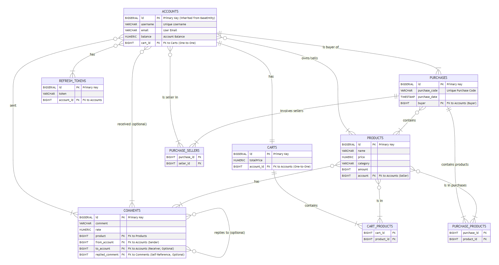

# TechStore


TechStore is a full-stack e-commerce web application focused on selling technology products such as mobile phones, laptops, monitors, and accessories.
It features a modern React frontend with dynamic filtering, responsive UI behavior, and hash-based routing, and a robust Spring Boot backend exposing secure REST APIs.

On the backend, TechStore integrates **PostgreSQL** for persistent storage, **Redis** for caching and token storage, and **Stripe** for online payments.
The system uses **JWT authentication** with refresh tokens, email verification, and **Liquibase** migration scripts for version-controlled schema updates.

The entire application is containerized using **Docker** for consistent deployment across environments.

## 🌐Live Deployment

[Visit TechStore Webpage](https://yourfavouritedeveloper.github.io/TechStore/)


## Table of Contents

- [Purpose](#purpose)
- [Features](#key-features)  
- [Advanced Security & Core System Components](#advanced-security-and-core-system-components)
- [Tech Stack](#architecture-overview) 
- [Database Schema](#database-schema)
- [Getting Started](#getting-started)  
  - [Prerequisites](#prerequisites)  
  - [Backend Setup](#backend-setup)  
  - [Frontend Setup](#frontend-setup)  
- [Running with Docker](#running-with-docker)  
- [Authentication and Security](#authentication-and-security)  
- [CORS Configuration](#cors-configuration)  
- [Project Structure](#project-structure)  
- [API Endpoints Reference](#api-endpoints-reference)


### Purpose

The primary goal of TechStore is to demonstrate how to build a full-featured e-commerce platform using contemporary technologies. It showcases:

- Efficient frontend state management and UI filtering techniques  
- Secure backend development with **Spring Security** and JWT authentication with role-based access control  
- Integration with PostgreSQL for persistent data storage and Redis for caching  
- Utilization of **MapStruct** for efficient data transfer object (DTO) mapping.
- Deployment best practices using Docker and cloud hosting services  

This project also serves as a portfolio piece for fullstack Java developers who want to demonstrate real-world skills.

---

## Key Features

- **Advanced Authentication:** Secure Register/Login utilizing **Spring Security**, featuring **JWT Access** and **Refresh Tokens** for a robust authentication lifecycle.
- **Role-Based Access Control (RBAC):** Fine-grained authorization to restrict access to sensitive endpoints (e.g., admin-only API calls).
- **Secure Payments:** Full integration with the **Stripe Payment Gateway** for secure checkout and customer management.
- **Account Verification:** Mandatory **Email Verification** using a **One-Time Password (OTP)** mechanism, facilitated by Spring Mail/SendGrid.
- **RESTful API Documentation:** Interactive, auto-generated API documentation using **SpringDoc OpenAPI (Swagger UI)**.
- **Data Integrity:** Version-controlled database schema management using **Liquibase**.
- **Performance:** Redis caching layer to significantly improve response times for frequently requested data.
- **Responsive Design:** Works seamlessly on desktops, tablets, and mobile devices.  
- **Dockerized Setup:** Containerized backend and frontend for consistency across development and production.  

---

## Advanced Security & Core System Components

This section provides a deeper look into the critical, non-trivial components of the TechStore backend.

### 1. Secure Authentication (JWT Lifecycle)
* **Access/Refresh Tokens:** The system employs a dual-token strategy. The **Access Token** is short-lived for securing API calls, while the longer-lived **Refresh Token** is used solely to obtain a new Access Token without re-authentication, enhancing both security and user experience.
* **Role-Based Access Control (RBAC):** Using Spring Security, access to administrative endpoints (e.g., `/api/v1/accounts/all`) is strictly restricted based on user roles (`ADMIN`, `USER`).
* **Token Storage:** **Redis** is utilized for efficient, non-persistent storage of JWT refresh tokens and blacklisted tokens, enabling quick invalidation.

### 2. Payment Gateway Integration (Stripe)
* **Secure Checkout:** The backend uses the **Stripe Java SDK** to manage all payment flows.
* **Customer Auto-Creation:** Upon user registration (`/api/v1/accounts/register`), a corresponding **Stripe Customer** object is automatically created to facilitate future purchases, subscriptions, and centralized transaction history.
* **Endpoint Delegation:** The `/api/v1/purchases/checkout` endpoint securely creates Stripe Checkout Sessions, delegating the handling of sensitive card data entirely to Stripe.

### 3. Account Verification & Recovery
* **Email Verification (OTP):** New user accounts must be verified via email. The system generates a secure **One-Time Password (OTP)** and sends it via email (using Spring Mail/SendGrid). The account remains inactive until the user successfully verifies the OTP via `/api/v1/accounts/otp/verify`.
* **Password Recovery:** A similar OTP mechanism is used for secure password recovery requests (`/api/v1/accounts/recovery/password`), ensuring only the email owner can initiate a password change.


---

## Architecture Overview

- **Frontend:** React (with Vite), Axios for API calls, React Router for navigation, CSS modules for styling.  
- **Backend:** **Spring Boot (Java 21)**, **Spring Security with JWT**, PostgreSQL as the main database, Redis for caching, **SpringDoc OpenAPI** for API documentation.
- **Data Mapping:** **MapStruct** for type-safe and performant object mapping.
- **Storage:** Product images and static resources served securely with proper access control.  
- **Deployment:** Docker for containerization, automated CI/CD pipelines for builds and deployments.  

---


| Layer        | Technology             |
|--------------|------------------------|
| Frontend     | React, Vite, Axios     |
| Backend      | Java 21, Spring Boot   |
| Database     | PostgreSQL             |
| Cache        | Redis                  |
| Authentication | JWT                   |
| Containerization | Docker               |
| Deployment   | Render (backend), GitHub Pages (frontend) |


## Tech Stack

| Layer        | Technology             | Key Feature |
|--------------|------------------------|-------------|
| Frontend     | React, Vite, Axios     | Dynamic UI, State Management |
| Backend      | Java 21, Spring Boot   | **Spring Security**, **SpringDoc OpenAPI** |
| Database     | PostgreSQL             | **Liquibase** (Schema Migration) |
| Cache        | Redis, Jedis           | Session & Token Storage, Data Caching |
| Authentication | JWT                   | Access & Refresh Tokens, RBAC |
| Payments     | **Stripe** | Checkout and Customer Management |
| Messaging    | **Spring Kafka** | Event-Driven Architecture, Decoupling |
| Utilities    | **MapStruct**, Lombok | DTO Mapping, Boilerplate Reduction |
| Containerization | Docker               | Consistency across Environments |
| Deployment   | Render, GitHub Pages   | Cloud Hosting |

---


## Database Schema



- The Accounts table stores all users, including customers and sellers, with their credentials, roles, and financial details. 
- The Products table contains all items available for sale, linked to the seller account, with pricing, category, and analytics like rating and popularity. 
- The Carts table represents each user's shopping cart and tracks which products are added and their quantities.
- The Purchases table records completed transactions, linking buyers, sellers, products, and payment details.
- Comments and RefreshTokens tables manage user feedback on products and authentication tokens, respectively.


---


## Getting Started

### Prerequisites

Before you start, make sure you have installed:

- [Java 21 JDK](https://adoptium.net/)
- [Gradle 8.5+](https://gradle.org/install/)
- [Node.js & npm](https://nodejs.org/) (or yarn)
- [Docker](https://www.docker.com/get-started) (optional but recommended)
- **PostgreSQL database**
- **Redis server**


---

## Backend Setup

1. **Clone the repository:**

   ```bash
   git clone https://github.com/yourfavouritedeveloper/TechStore.git
   cd TechStore/backend
   ```

2. **Configure database and cache:**

    - Edit src/main/resources/application.yml (or application.properties) and update the PostgreSQL and Redis connection properties:

   ```yaml
        spring:
        datasource:
            url: jdbc:postgresql://localhost:5432/your_db_name
            username: your_username
            password: your_password
        redis:
            host: localhost
            port: 6379
        kafka:
            bootstrap-servers: localhost:9092 # Update with your Kafka broker address

        # Add Stripe keys and SendGrid/Mail properties as required
        stripe:
        secret-key: sk_...
   ```

3. **Build the backend:**

   ```bash
   ./gradlew build -x test
   ```

4. **Run the backend server:**

    -  Using Gradle:

   ```bash
   ./gradlew bootRun
   ```

    - Or run the JAR directly:
    ```bash
    java -jar build/libs/techstore.jar
    ```

    - The backend will start on http://localhost:8080/api/v1.


## Frontend Setup


1. **Navigate to the frontend folder:**
    ```bash
    cd ../frontend
    ```

2. **Install dependencies:**
    ```bash
    npm install
    ```

3. **Run the development server:**
    ```bash
    npm run dev
    ```   
    - The app will be available at http://localhost:5173.

4. **Build the production version:**
    ```bash
    npm run build
    ```

5. **Preview the production build locally:**
    ```bash
    npm run preview
    ```


## Running with Docker

### Backend

1. **Build the Docker image:**
    ```bash
    docker build -t techstore-backend .
    ```

2. **Run the container::**
    ```bash
    docker run -p 8080:8080 techstore-backend
    ```
   - Make sure your PostgreSQL and Redis instances are accessible or containerized as well.

### Frontend

   - You can serve the production build with any static file server. For example:


     ```bash
     npm run build
     npx serve dist
     ```

   - Or deploy the build folder to GitHub Pages or any static hosting.


## Troubleshooting

- **CORS Issues:** Make sure backend allows requests from your frontend origin

- **Authentication:** Some endpoints require JWT tokens; ensure login is performed

- **API Documentation:** If you can't access Swagger UI, ensure the springdoc dependencies are correctly packaged and the application is running

- **Image Loading:** Verify authentication settings allow public access to /images/** if used publicly

- **404 Errors:** Confirm static assets are correctly served and URLs are properly formed

## Authentication and Security
- Spring Security and JWT-based authentication secure backend endpoints.

- Public endpoints such as product listings and image resources have been configured to allow unauthenticated access.

- Make sure to add /images/**, /api/v1/products/**, and /swagger-ui/** (for documentation) to your Spring Security permitAll() configuration to prevent unauthorized errors.


## CORS Configuration

To enable your frontend app to consume backend APIs without CORS errors:

- Configure CORS in your Spring Boot backend to allow requests from your frontend domain(s), e.g.:

```java
@Bean
public WebMvcConfigurer corsConfigurer() {
    return new WebMvcConfigurer() {
        @Override
        public void addCorsMappings(CorsRegistry registry) {
            registry.addMapping("/api/**")
                    .allowedOrigins("http://localhost:5173", "https://yourfavouritedeveloper.github.io")
                    .allowedMethods("GET", "POST", "PUT", "DELETE");
        }
    };
}
```


## Project Structure

```bash
TechStore/
├── Backend/
│   ├── .gradle/
│   ├── .idea/
│   ├── build/
│   ├── gradle/
│   ├── uploads/
│   ├── .env
│   ├── .gitattributes
│   ├── .gitignore
│   ├── build.gradle
│   ├── docker-compose.yml
│   ├── Dockerfile
│   ├── gradlew
│   └── gradlew.bat
│
│   └── src/com/tech/store/
│       ├── config/
│       ├── controller/
│       ├── dao/
│       ├── exception/
│       ├── mapper/
│       ├── model/
│       ├── service/
│       └── util/
│
├── Frontend/
│   ├── dist/
│   ├── node_modules/
│   ├── public/
│   ├── src/
│   │   ├── assets/
│   │   ├── Components/
│   │   │   ├── Account/
│   │   │   ├── AddItem/
│   │   │   ├── Background/
│   │   │   ├── Body/
│   │   │   ├── Campaign/
│   │   │   ├── CampaignAdd/
│   │   │   ├── CampaignPage/
│   │   │   ├── Cart/
│   │   │   ├── Category/
│   │   │   ├── Choice/
│   │   │   ├── EditItem/
│   │   │   ├── Filter/
│   │   │   ├── Footer/
│   │   │   ├── Item/
│   │   │   ├── Items/
│   │   │   ├── Login/
│   │   │   ├── Main/
│   │   │   ├── Model/
│   │   │   ├── Nav/
│   │   │   ├── Product/
│   │   │   ├── Purchase/
│   │   │   ├── Recovery/
│   │   │   ├── Success/
│   │   │   └── Utils/
│   │   ├── Pages/
│   │   ├── App.*
│   │   ├── index.*
│   │   └── main.*
│   ├── .gitignore
│   ├── eslint.config
│   ├── index.html
│   ├── package.json
│   ├── package-lock.json
│   └── README.md

```


# API Endpoints Reference


## Account API

| Method | Endpoint | Description |
|--------|---------|-------------|
| GET    | `/api/v1/accounts/{id}` | Get account by ID |
| GET    | `/api/v1/accounts/username/{username}` | Get account by username |
| GET    | `/api/v1/accounts/email/{email}` | Get account by email |
| GET    | `/api/v1/accounts/all` | Get all accounts (Admin only) |
| POST   | `/api/v1/accounts/register` | Register a new account (Stripe customer auto-creation) |
| POST   | `/api/v1/accounts/login` | Log in and receive JWT access + refresh tokens |
| POST   | `/api/v1/accounts/refreshToken` | Generate a new access token using a refresh token |
| PUT    | `/api/v1/accounts/update` | Update account details |
| PUT    | `/api/v1/accounts/password` | Change account password |
| PUT    | `/api/v1/accounts/uploadProfilePicture` | Upload or update profile picture |
| PUT    | `/api/v1/accounts/otp/send` | Send OTP verification code to email |
| PUT    | `/api/v1/accounts/otp/verify` | Verify OTP and activate account |
| PUT    | `/api/v1/accounts/recovery/password` | Request password recovery email |
| PUT    | `/api/v1/accounts/delete/{id}` | Soft delete (close) an account |
| PUT    | `/api/v1/accounts/activate/{id}` | Reactivate a previously closed account |
| DELETE | `/api/v1/accounts/remove/{id}` | Permanently delete an account |

---

## Cart API

| Method | Endpoint | Description |
|--------|---------|-------------|
| GET    | `/api/v1/carts/id/{id}` | Get cart by ID |
| GET    | `/api/v1/carts/account/{accountId}` | Get cart by account ID |
| GET    | `/api/v1/carts/all` | Get all carts |
| POST   | `/api/v1/carts/create` | Create a new cart |
| PUT    | `/api/v1/carts/update` | Update cart details |
| PUT    | `/api/v1/carts/add/product/{cartId}` | Add a product to a cart |
| PUT    | `/api/v1/carts/remove/product/{cartId}` | Remove a product from a cart |
| PUT    | `/api/v1/carts/delete/{id}` | Soft delete a cart |
| DELETE | `/api/v1/carts/remove/{id}` | Permanently delete a cart |

---

## Comment API

| Method | Endpoint | Description |
|--------|---------|-------------|
| GET    | `/api/v1/comments/{id}` | Get comment by ID |
| GET    | `/api/v1/comments/fromAccount` | Get comments by sender account |
| GET    | `/api/v1/comments/toAccount` | Get comments by receiver account |
| GET    | `/api/v1/comments/product` | Get comments by product ID |
| POST   | `/api/v1/comments/comment/{fromAccount}` | Add a comment to a product |
| POST   | `/api/v1/comments/reply/{commentId}/{fromAccount}/{toAccount}` | Reply to a comment |
| POST   | `/api/v1/comments/like` | Like a comment |
| PUT    | `/api/v1/comments/delete/{id}` | Soft delete a comment |
| DELETE | `/api/v1/comments/remove/{id}` | Permanently delete a comment |

---


## Product API

| Method | Endpoint | Description |
|--------|---------|-------------|
| POST   | `/api/v1/products/uploadProductImage` | Upload product image |
| POST   | `/api/v1/products/uploadProductVideo` | Upload product video |
| GET    | `/api/v1/products/id/{id}` | Get product by ID |
| GET    | `/api/v1/products/name/{name}` | Get product by name |
| GET    | `/api/v1/products/all` | Get all products |
| GET    | `/api/v1/products/account/{accountId}` | Get products by account |
| GET    | `/api/v1/products/popular` | Get top 5 most popular products |
| GET    | `/api/v1/products/bought` | Get top 5 most bought products |
| POST   | `/api/v1/products/create` | Create a new product |
| PUT    | `/api/v1/products/update` | Update product details |
| PUT    | `/api/v1/products/update/rating/{productId}` | Update product rating |
| PUT    | `/api/v1/products/delete/{id}` | Soft delete a product |
| DELETE | `/api/v1/products/remove/{id}` | Permanently delete a product |

---

## Purchase API

| Method | Endpoint | Description |
|--------|---------|-------------|
| POST   | `/api/v1/purchases/purchase` | Make a purchase |
| POST   | `/api/v1/purchases/checkout` | Stripe checkout |
| GET    | `/api/v1/purchases/{id}` | Get purchase by ID |
| GET    | `/api/v1/purchases/account/from/{id}` | Get purchases by buyer account |
| GET    | `/api/v1/purchases/account/to/{id}` | Get purchases by seller account |
| GET    | `/api/v1/purchases/all` | Get all purchases |
| PUT    | `/api/v1/purchases/delete/{id}` | Soft delete a purchase |
| DELETE | `/api/v1/purchases/remove/{id}` | Permanently delete a purchase |

---

### Notes

- **Soft delete** endpoints mark the resource as inactive or closed but keep it in the database.
- **Hard delete** endpoints permanently remove the resource.
- Update endpoints expect partial updates via **query parameters**.
- Purchase creation requires `productId` (list of IDs) and `amount` as **request parameters**.


## Conclusion

This API provides a robust foundation for managing users, products, and purchases within the TechStore application.

With clear RESTful conventions, comprehensive security from Spring Security, schema control via Liquibase, payment integration with Stripe, event handling with Kafka, and auto-generated documentation via SpringDoc OpenAPI, it ensures flexibility and data integrity.

For any questions, feature requests, or contributions, please feel free to open an issue or submit a pull request.

Happy coding!
